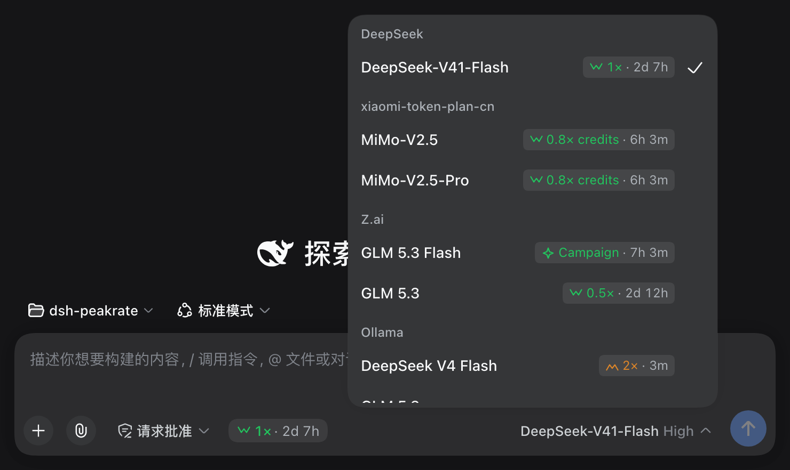
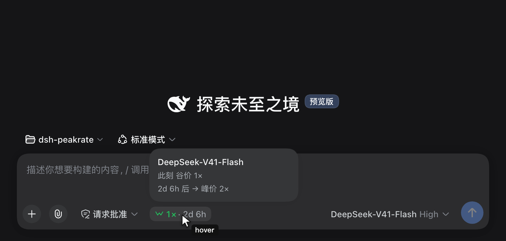
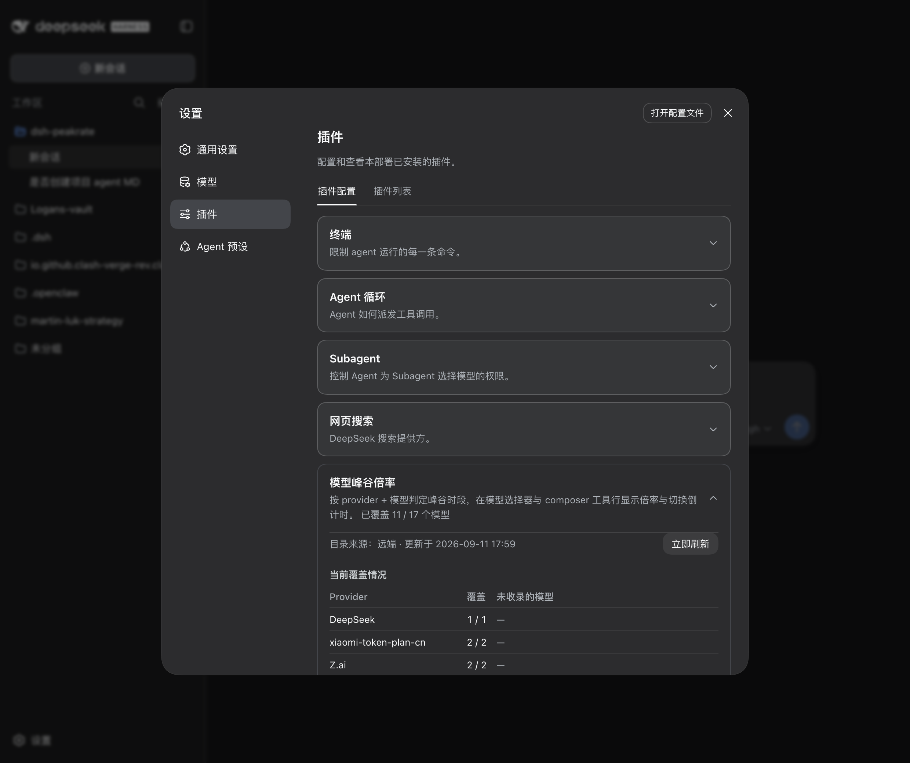

<div align="center">

# dsh-peakrate ⛰️

**Peak / off-peak rate badges for [DeepSeek Harness](https://github.com/deepseek-ai/deepseek-harness)** — see what each model actually costs *right now*, per provider, per model, before you switch to it.

> 🌐 **简体中文**: [README.zh.md](./README.zh.md) · **English**: [README.md](./README.md)

[](https://www.npmjs.com/package/dsh-peakrate)
[](https://www.npmjs.com/package/dsh-peakrate)
[](./LICENSE)
[](https://github.com/log-li/dsh-peakrate)
[](https://github.com/log-li/dsh-peakrate)
[](https://github.com/log-li/dsh-peakrate)
[](https://github.com/topics/dsh-plugin)
[](https://github.com/log-li/dsh-peakrate/actions/workflows/ci.yml)



</div>

---

Every provider bills on its own clock. DeepSeek charges more during peak hours by Beijing time; Ollama's window is UTC; Z.ai runs limited-time campaigns with their own date ranges. Route the *same* model through two of them and the rate you are paying can be different at this very moment.

dsh-peakrate reads the schedule that applies to each provider, works out the state at *this* moment, and puts the answer where you are already looking — on every row of the model selector, and next to the composer.

**Three states, not two.** Peak and off-peak are the familiar pair. The third — **campaign** — is a limited-time promotional window with its own date range and weekday filter, and it outranks the regular cycle while it lasts.

**One rule that matters:** every window is evaluated against real timestamps, so DST transitions and windows that cross midnight come out **correct** rather than approximately correct.

## ✨ Key features

- ⛰️ **Per-provider judgement** — each provider is evaluated in **its own IANA time zone** against **its own schedule**. No DeepSeek-only assumptions.
- 🌗 **Three rate states** — `peak`, `offPeak`, and **`campaign`** (date-ranged promotional windows that take precedence over the regular cycle).
- ⏱️ **Switch countdown** — not just the current rate, but when it ends and what it becomes: `1× · 2d 7h`, `2d 6h → 2×`.
- 💬 **A theme-aware hover card** — the detail is drawn in-page, not an OS tooltip, so it matches the harness styling and is reachable by keyboard focus too.
- 📋 **Every row in the model selector** — compare providers *before* switching. Selection only ever happens from this panel, so the information lands exactly where the decision does.
- 📌 **Composer tool-row badge** — the current model's rate and countdown, one glance away, no menu required.
- 🔄 **Live catalog** — the host half refreshes the shared catalog every 24 hours and serves it to the page over a fenced route, so a data update reaches the badges without a rebuild. **Refresh now** is one click away in the coverage panel.
- 🔍 **Coverage panel** — under *Settings → Plugins*, every configured provider × model with what it matched, plus a warning for any provider where **nothing at all** matched. That shape is a silent misconfiguration, and it is the one thing this plugin is designed never to hide.
- 🧭 **`npm run audit`** — an offline coverage sweep over the live provider × model set, flagging providers that need a decision.
- 🪶 **Zero runtime dependencies** — time arithmetic is `Intl.DateTimeFormat` and `Date`. No date library.
- 🎨 **Design-token styling** — colours come from the harness's own `--dsw-*` tokens, so it follows light/dark with everything else.
- 🌐 **Bilingual** — every string goes through the harness locale service; the plugin ships complete **English** and **简体中文** dictionaries and follows your harness language setting.

## 📚 Table of contents

- [Install](#install)
- [What you see](#what-you-see)
- [How it works](#how-it-works)
- [Coverage panel](#coverage-panel)
- [Configuration](#configuration)
- [Data source & freshness](#data-source--freshness)
- [Architecture](#architecture)
- [Compatibility & contributions](#compatibility--contributions)
- [License](#license)

## Install

```bash
dsh plugin add dsh-peakrate
```

From a local checkout:

```bash
dsh plugin add ./path/to/dsh-peakrate
```

**Restart `dsh web` after installing.** The plugin declares a settings namespace on the host half, and host code is only read at boot. After the restart the coverage card appears under **Settings → Plugins → Plugin configuration**.

## What you see

**In the model selector** — open the picker you already use (the shot at the top), and every row
carries the rate that applies to that model at this moment. The same rate stays visible in the
composer tool row below, so what you are paying never leaves your sight.

Every shape of rate is in play above: `2×` peak, `1×` and `0.5×` off-peak, a `0.8× credits` plan, and a limited-time `Campaign` window. Models with no time-based pricing simply carry no badge — that is the honest state, not a missing lookup.

**Hover the badge** for the detail: the state now, and what it becomes and when. The card is drawn
by the plugin itself (not an OS tooltip), so it follows the theme and is reachable by keyboard
focus too:



### The three states

| State | Meaning | Colour | Icon |
|---|---|---|---|
| `peak` | Standard rate | warning (amber) | twin peaks |
| `offPeak` | Discounted rate | success (green) | twin valleys |
| `campaign` | Limited-time promotion | success (green) | sparkle |

Colour carries **expensive vs. cheap**; the icon carries **which state it is**. The icons are deliberately *landscape shapes* rather than trending arrows — an arrow reads as "this is about to go up or down", while a peak is simply a high point. Direction and shape are not the same claim.

A row shows nothing at all when no profile matches that model. That is intentional: a model without time-based pricing should not be decorated with a rate it does not have.

## How it works

```
provider id ──┐
              ├─► alias ──┐
model id ─────┘           ├─► profile ─► schedule ─► state at now ─► badge + countdown
                          │
catalog (live or bundled) ┘
```

1. **Match.** The provider id goes through an alias table (`ollama` → *Ollama*). Provider ids are local labels you chose; the alias table is how a label becomes a billing reality. The model id is then normalised (a `:tag` suffix is stripped, case and separators unified) and matched against per-provider model patterns.
2. **Evaluate.** The matched profile's `schedule` is evaluated in its own time zone. Peak windows, weekday filters, and any active override are considered together, and **overrides win** while their date range and weekday filter allow.
3. **Render.** The state and its countdown are rendered in the model selector, the composer tool row, and the coverage panel.

### Time correctness

The arithmetic deliberately avoids "wall-clock minutes plus 1440" shortcuts, which produce countdowns that are off by an hour across a DST boundary — and off by a day at a window edge. Instead, wall-clock candidates are converted back to **real timestamps** and compared against `now`.

Cross-midnight windows (`23:00–09:00`) belong to **the day they start**, so the early-morning half is judged against the start day's date and weekday. This holds for promotional overrides exactly as it does for ordinary peak windows.

### Extending coverage

Judgement is made against a curated catalog, so a provider is either **mapped** or **documented as deliberately unmapped**. There is no third, silent outcome — the coverage panel and the test suite both enforce that:

- a provider whose endpoint resells another vendor's pricing (a gateway) **inherits the upstream schedule** — the catalog lists direct vendors, not resellers;
- a provider with genuinely no time-based pricing gets an explicit entry with a written reason;
- anything else shows up as a warning in the coverage panel.

## Coverage panel

**Settings → Plugins → Plugin configuration.** It does three jobs: **show coverage**, **surface a
silent misconfiguration**, and **refresh the catalog**.




| Column | Meaning |
|---|---|
| Provider | The configured provider, as the harness knows it |
| Covered | How many of its models matched a profile |
| Not covered | The models that matched nothing |

A provider where **nothing at all** matched is raised to the top as a warning. Partial coverage is deliberately *not* flagged: a provider commonly mixes models with and without time-based pricing (an Ollama group holding both DeepSeek and GLM, for instance), and flagging every such row would be noise.

The **source line** at the top (visible in the screenshot above) reports whether the current catalog
is the *remote* one or the *bundled snapshot*, with **Refresh now** beside it. `enabled` and
`refreshIntervalHours` are editable here and take effect immediately.

## Configuration

Configuration lives in the profile's `cordis.patch.yml`:

```yaml
- id: peakrate
  config:
    # provider id → catalog provider name
    providerAliases:
      my-gateway: DeepSeek
    # provider-scoped model patterns; first match wins
    modelMappings:
      - provider: my-gateway
        match: "^deepseek-v4"
        profile: deepseek-v4
      - provider: my-gateway
        match: "glm-5\\.3-flash"
        matchIsRegex: true
        profile: zai-glm-5-3-flash
    # fetch interval; 0 disables the background refresh
    refreshIntervalHours: 24
    catalogUrl: https://offpeakclock.com/pricing.json
    cachePath: ~/.dsh/peakrate/pricing.json
```

| Option | Default | Description |
|---|---|---|
| `enabled` | `true` | Background refresh switch. Also editable in the coverage panel. |
| `refreshIntervalHours` | `24` | Hours between catalog refreshes. `0` disables it. Also editable in the panel. |
| `catalogUrl` | the public catalog | Remote catalog URL. |
| `cachePath` | `~/.dsh/peakrate/pricing.json` | On-disk cache of the last successful fetch. |
| `providerAliases` | built-in table | Extra `provider id → catalog provider` mappings. Yours win over the built-ins. |
| `modelMappings` | built-in table | Extra `provider + model pattern → profile` mappings. Yours are tried first. |
| `customProfiles` | `[]` | Additional profiles: override a bundled entry by `id`, or add a new one. They take part in badge judgement too. |

`modelMappings` entries are prefix matches by default; set `matchIsRegex: true` for a regular expression. Invalid regexes do not throw — they simply never match.

> **`customProfiles` fully applies, badges included.** The host serves its merged catalog over
> `/peakrate/catalog`, so a custom profile takes part in badge judgement exactly like a bundled one —
> either overriding a bundled entry by `id`, or adding a new one. Verified: pointing `deepseek-v4`
> at a custom profile with `peak: 9×` changes both the served catalog and the badge to `9×`.

## Data source & freshness

The catalog is [offpeakclock.com/pricing.json](https://offpeakclock.com/pricing.json) (`schemaVersion: 1`), a community-maintained snapshot of provider peak/off-peak schedules.

**How an update reaches your screen:**

1. The **host** fetches the catalog at boot and every `refreshIntervalHours` (default 24h), validates it, and caches it to disk.
2. The host serves the current catalog over **`GET /peakrate/catalog`**, and re-fetches on demand for **`POST /peakrate/catalog`** (the *Refresh now* button).
3. The **client** asks for it once at startup and re-renders when it arrives. If the request fails — offline, first run, blocked — it silently falls back to the snapshot bundled at build time, so the badges never disappear because of a network problem.

Because the page reads the host's live catalog, **a data update reaches the badges without rebuilding or reinstalling the plugin**. The bundled snapshot remains as the offline fallback.

### The route is fenced

`/peakrate/catalog` is not an open endpoint. It applies the same browser-trust fence as the harness's own `/api` route, defending the two confused-deputy paths a browser opens against a local HTTP server:

- **DNS rebinding** — the `Host` header (which rebinding cannot forge) must be loopback or a `trustedHosts` authority; anything else is `403`.
- **Cross-site requests** — `Sec-Fetch-Site: cross-site` is refused, and any attached `Origin` must match `Host`.

It is a trust fence, **not an authentication layer**: network reachability stays the webserver's business. The endpoint serves public pricing data.

Fetched catalogs are validated strictly: unknown schema versions, malformed clock values, zero-length windows, non-`YYYY-MM-DD` dates and duplicate profile ids are rejected at parse time rather than producing a wrong judgement later.

## Architecture

| Module | Responsibility |
|---|---|
| `index.ts` | host: catalog fetch/cache, user config, settings namespace, serving route |
| `catalog.ts` | parse + validate the catalog document |
| `catalog-route.ts` | the fenced `/peakrate/catalog` route |
| `schedule.ts` · `matching.ts` · `coverage.ts` | **pure**: state + countdown / provider+model matching / coverage report |
| `client/` | the three surfaces, runtime catalog fetch with fallback, selector fork, icons, styles |

`schedule.ts`, `matching.ts` and `coverage.ts` are pure and runtime-independent; every time boundary
and matching rule is covered by unit tests.

### Surfaces

| Where | Slot | Kind |
|---|---|---|
| Composer tool row | `conversation.input.left` | additive |
| Model selector | `conversation.input.model` | **deliberate takeover** (functional superset) |
| Coverage panel | `settings.plugin.item` | additive, keyed by this plugin's settings namespace |

The model-selector takeover ships a complete superset of the official component — keyboard navigation, aria wiring, portal positioning, loading, empty, error and retry states, and the reasoning-effort submenu. The upstream package is MIT and the ported version is recorded in `src/client/index.tsx`; the guard test in `test/bundle-contract.test.ts` fails the build if any *other* shipped-UI slot is ever shadowed.

## Compatibility & contributions

- Requires a DeepSeek Harness build providing the `conversation.input.model` and `settings.plugin.item` slots. Upstream selector ported from `@deepseek-ai/dsh-client-ui-model-selection@0.1.5-rc.1`.
- Peer dependencies: `@deepseek-ai/cordis`, `@deepseek-ai/schemastery`.
- **Commits** follow [Conventional Commits](https://www.conventionalcommits.org/). The changelog follows [Keep a Changelog](https://keepachangelog.com/).
- **Releases** are cut by pushing a `v*` tag; the [release workflow](./.github/workflows/release.yml) runs typecheck + tests, builds, publishes to npm with provenance, and opens the GitHub Release from `CHANGELOG.md`.
- Issues and pull requests are welcome at [github.com/log-li/dsh-peakrate](https://github.com/log-li/dsh-peakrate).

## Contributors

| Contributor | Role |
|---|---|
| [@log-li](https://github.com/log-li) | Author and maintainer |

## License

[MIT](./LICENSE) © Logan Lin
