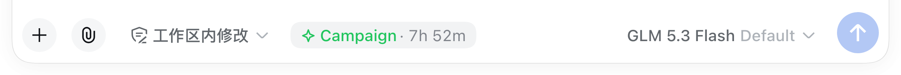

<div align="center">

# dsh-peakrate ⛰️

**给 [DeepSeek Harness](https://github.com/deepseek-ai/deepseek-harness) 的峰谷倍率徽章** —— 切过去之前，先看清每个模型**此刻**到底什么价。按 provider、按模型。

> 🌐 **简体中文**: [README.zh.md](./README.zh.md) · **English**: [README.md](./README.md)

[](https://www.npmjs.com/package/dsh-peakrate)
[](https://www.npmjs.com/package/dsh-peakrate)
[](./LICENSE)
[](https://github.com/log-li/dsh-peakrate)
[](https://github.com/log-li/dsh-peakrate)
[](https://github.com/log-li/dsh-peakrate)
[](https://github.com/topics/dsh-plugin)
[](https://github.com/log-li/dsh-peakrate/actions/workflows/ci.yml)


</div>

---

每家 provider 都按**自己的钟**计费。DeepSeek 按北京时区分峰谷；Ollama 的窗口是 UTC；Z.ai 还有带日期区间的限时活动。**同一个模型经不同 provider 路由，此刻的价可能完全不同。**

dsh-peakrate 读出每个 provider 各自适用的时段规则，算出**此刻**落在哪一态，然后把它放到你本来就在看的地方 —— 模型选择器的**每一行**，以及 composer 旁边。

**三种时段态，不是两种。** 峰与谷是熟悉的那一对；第三种 **campaign** 是带日期区间与星期过滤的限时活动窗口，在有效期内**优先级高于常规峰谷**。

**一条最要紧的规则**：所有窗口都按**真实时间戳**判定，所以 DST 切换与跨午夜的窗口是**正确**的，而不是近似正确。

## ✨ 主要特性

- ⛰️ **按 provider 分别判定** —— 每个 provider 用**自己的 IANA 时区**与**自己的时段规则**，不套用 DeepSeek 的时段。
- 🌗 **三种时段态** —— `peak` / `offPeak` / **`campaign`**（限时活动，优先级高于常规峰谷）。
- ⏱️ **切换倒计时** —— 不只当前倍率，还有何时结束、会变成什么：`1× · 2d 7h`、`2d 6h → 2×`。
- 💬 **跟随主题的悬停浮层** —— 详情由页面自己绘制而非系统 tooltip，风格与 harness 一致，键盘聚焦也能唤出。
- 📋 **模型选择器每一行** —— 切换**之前**就能比价。选型只在这个面板里发生，信息正好落在决策点。
- 📌 **composer 工具行徽章** —— 当前模型的倍率与倒计时，抬眼可见，不用开菜单。
- 🔄 **目录实时更新** —— host 半边每 24 小时刷新共享目录，并经**带信任围栏的路由**下发到页面，数据更新**无需重新构建**即可上屏；覆盖面板里一键「立即刷新」。
- 🔍 **覆盖面板** —— 设置 → 插件里，逐 provider 列出「命中 / 总数 / 未收录的模型」，并对**整组零命中**的 provider 告警。那正是静默漏配的形态，也是本插件**最不愿意隐藏**的东西。
- 🧭 **`npm run audit`** —— 离线覆盖穷举：枚举运行时的 provider × model，挑出需要人工决策的 provider。
- 🪶 **零运行时依赖** —— 时间计算只用 `Intl.DateTimeFormat` 与 `Date`，不引入日期库。
- 🎨 **只用设计 token** —— 颜色来自 harness 自己的 `--dsw-*`，跟随明暗主题。
- 🌐 **中英双语** —— 全部文案经 harness 的 locale 服务，内置**完整的中文与英文**两本字典，跟随你的 harness 语言设置。

## 📚 目录

- [安装](#安装)
- [你会看到什么](#你会看到什么)
- [工作原理](#工作原理)
- [覆盖面板](#覆盖面板)
- [配置](#配置)
- [数据来源与新鲜度](#数据来源与新鲜度)
- [架构](#架构)
- [兼容性与贡献](#兼容性与贡献)
- [许可](#许可)

## 安装

```bash
dsh plugin add dsh-peakrate
```

从本地检出安装：

```bash
dsh plugin add ./path/to/dsh-peakrate
```

**装完请重启 `dsh web`。** 本插件在 host 半边声明了 settings 命名空间，而 host 代码只在启动时读取。重启后覆盖卡片会出现在 **设置 → 插件 → 插件配置**。

## 你会看到什么

**模型选择器里** —— 打开你本来就在用的选择器，每一行都带该模型此刻适用的倍率。同一个倍率同时**常驻在下方 composer 工具行**，你付的什么价一直看得见：


上图里四种倍率形态同时在场：`2×` 峰时、`1×` 与 `0.5×` 谷时、`0.8× credits` 套餐、以及限时的 `Campaign` 活动。
没有时段计价的模型**就是不带徽章** —— 那是诚实的状态，不是漏查。

**composer 工具行里** —— 当前模型的倍率，始终可见：



**悬停徽章**看详情：此刻什么态、多久之后变成什么。浮层由插件**自己绘制**（非系统 tooltip），
跟随明暗主题，键盘聚焦同样能唤出：


### 三种时段态

| 态 | 含义 | 颜色 | 图标 |
|---|---|---|---|
| `peak` | 标准价 | 警示（橙） | 双峰山 |
| `offPeak` | 折扣价 | 成功（绿） | 双谷 |
| `campaign` | 限时活动 | 成功（绿） | 星芒 |

**颜色表达「贵/便宜」，图标表达「是哪个时段态」。** 图标刻意用**地貌形状**而不是涨跌箭头 —— 箭头会被读成「它要涨/要跌了」，而山峰只是「一个高点」。方向与形状不是同一个断言。

某个模型没有匹配到任何 profile 时，那一行**什么都不显示**。这是有意的：没有时段计价的模型，不该被贴上一个它并不拥有的倍率。

## 工作原理

```
provider id ──┐
              ├─► 别名 ──┐
model id ─────┘          ├─► profile ─► schedule ─► 此刻状态 ─► 徽章 + 倒计时
                         │
目录（实时或内置）────────┘
```

1. **匹配**：provider id 经过别名表（`ollama` → *Ollama*）。provider id 是你自己起的**本地标签**；别名表就是「标签 → 真实计费主体」的翻译。模型 id 随后被归一化（剥掉 `:tag` 后缀、统一大小写与分隔符），再按 provider 专属的模型模式匹配。
2. **判定**：用匹配到的 profile 自己的时区求值。峰时窗口、星期过滤、以及任何生效中的 override 一起考虑，**override 在日期区间与星期条件允许时优先**。
3. **呈现**：结果与倒计时渲染到模型选择器、composer 工具行与覆盖面板。

### 时间正确性

时间计算刻意避开了「墙钟分钟数 + 1440」这类捷径 —— 那会让倒计时在 DST 边界差一小时、在窗口边缘差一整天。这里的做法是把墙钟候选点**换算回真实时间戳**再与 `now` 比较。

跨午夜窗口（`23:00–09:00`）归属**它开始的那一天**，所以凌晨那半段按开始日的日期与星期判定。这对活动 override 与常规峰时窗口**完全一致**。

### 扩展覆盖范围

判定基于一份**精选目录**，因此一个 provider 要么**被映射**，要么**被明确记录为「有意不映射」**。**不存在第三种静默结局** —— 覆盖面板与测试套件都在强制这一点：

- endpoint 转售别家计费的（网关）**继承上游时段** —— 目录收录的是直连厂商，不是转售方；
- 确实没有时段计价的 provider，会得到一条**写明理由**的显式记录；
- 其余情况一律在覆盖面板里冒出告警。

## 覆盖面板

**设置 → 插件 → 插件配置**。它承担三件事：**看清覆盖**、**发现漏配**、**刷新目录**。


| 列 | 含义 |
|---|---|
| Provider | harness 所知的 provider |
| 覆盖 | 该 provider 下命中 profile 的模型数 |
| 未收录的模型 | 没有命中任何 profile 的模型 |

**整组零命中**的 provider 会被顶到前面并告警。**部分未命中刻意不告警**：同一个 provider 下常混有「有/无时段计价」两类模型（比如一个 Ollama 分组里既有 DeepSeek 又有 GLM），每行都提示等于没提示。

面板顶部的**数据来源行**（如上图的「目录来源：远端 · 更新于 …」）说明当前用的是远端目录还是内置快照；
右侧**「立即刷新」**强制重新拉取一次。`enabled` 与 `refreshIntervalHours` 也在这里编辑，**即时生效**。

## 配置

配置写在 profile 的 `cordis.patch.yml` 里：

```yaml
- id: peakrate
  config:
    # provider id → 目录里的 provider 名
    providerAliases:
      my-gateway: DeepSeek
    # 按 provider 限定模型模式；先匹配者胜
    modelMappings:
      - provider: my-gateway
        match: "^deepseek-v4"
        profile: deepseek-v4
      - provider: my-gateway
        match: "glm-5\\.3-flash"
        matchIsRegex: true
        profile: zai-glm-5-3-flash
    # 拉取间隔；0 表示关闭后台刷新
    refreshIntervalHours: 24
    catalogUrl: https://offpeakclock.com/pricing.json
    cachePath: ~/.dsh/peakrate/pricing.json
```

| 选项 | 默认 | 说明 |
|---|---|---|
| `enabled` | `true` | 后台刷新开关。也可在覆盖面板里改。 |
| `refreshIntervalHours` | `24` | 目录刷新间隔（小时）。`0` 关闭。也可在面板里改。 |
| `catalogUrl` | 公共目录 | 远端目录地址。 |
| `cachePath` | `~/.dsh/peakrate/pricing.json` | 最近一次成功拉取的磁盘缓存。 |
| `providerAliases` | 内置表 | 额外的 `provider id → 目录 provider` 映射，**覆盖内置**。 |
| `modelMappings` | 内置表 | 额外的 `provider + 模型模式 → profile` 映射，**先于内置尝试**。 |
| `customProfiles` | `[]` | 额外 profile（仅 host 侧生效，见下）。 |

`modelMappings` 默认是**前缀匹配**；写 `matchIsRegex: true` 则按正则。非法正则**不抛错**，只是永不命中。

> **`customProfiles` 完全生效**（含徽章）。host 会把合并后的目录经 `/peakrate/catalog` 下发给页面，
> 所以自定义 profile 与内置条目一样参与徽章判定 —— 按 `id` 覆盖内置条目，或追加新条目。
> 实测：给 `deepseek-v4` 写一条 `peak: 9×` 的自定义 profile，下发的目录与徽章都变成 `9×`。

## 数据来源与新鲜度

目录来自 [offpeakclock.com/pricing.json](https://offpeakclock.com/pricing.json)（`schemaVersion: 1`），一份社区维护的各 provider 峰谷时段快照。

**一次更新如何到达你的屏幕：**

1. **host** 在启动时以及每 `refreshIntervalHours`（默认 24 小时）拉取目录，校验后写入磁盘缓存。
2. host 通过 **`GET /peakrate/catalog`** 下发当前目录，并在 **`POST /peakrate/catalog`**（即「立即刷新」按钮）时按需重新拉取。
3. **client** 启动时请求一次，拿到即重渲染。若请求失败 —— 离线、首次运行、被围栏拒绝 —— 会**静默回退**到构建期内置快照，所以徽章**绝不会因为网络问题而消失**。

因为页面读的是 host 的实时目录，**数据更新无需重新构建或重装插件**即可上屏。内置快照作为离线兜底始终保留。

### 路由带信任围栏

`/peakrate/catalog` **不是开放端点**。它施加与 harness 自身 `/api` 相同的 browser-trust fence，防的是浏览器针对本地 HTTP 服务打开的两条 confused-deputy 通道：

- **DNS rebinding** —— `Host` 头（rebinding **无法伪造**它）必须是回环或 `trustedHosts` 里的 authority，否则 `403`。
- **跨站请求** —— `Sec-Fetch-Site: cross-site` 直接拒绝；带 `Origin` 时要求它与 `Host` 同源。

它是**信任围栏，不是认证层** —— 网络可达性仍归 webserver 管。该端点提供的是公开的定价数据。

拉取到的目录会被严格校验：未知 schema 版本、非法时钟值、零长度窗口、非 `YYYY-MM-DD` 日期、重复 profile id，都在**解析期**就被拒绝，而不是在之后产生一个错误判定。

## 架构

```
src/
├── index.ts          host：目录拉取/缓存、用户配置、settings 命名空间、路由
├── catalog.ts        解析并校验目录文档
├── catalog-route.ts  带信任围栏的 /peakrate/catalog 路由
├── schedule.ts       纯函数：某时刻的状态，以及到下一次切换的倒计时
├── matching.ts       纯函数：provider 别名 + 模型归一化 → profile
├── coverage.ts       纯函数：覆盖报告（面板与审计脚本共用）
└── client/
    ├── index.tsx          注册三处呈现 + locale 文案
    ├── live.ts            运行时目录拉取与内置回退
    ├── ModelSelect.tsx    官方选择器的忠实功能超集 fork
    ├── SettingsSection.tsx 覆盖卡片
    ├── rate.ts            共享的倍率解析
    ├── icons.tsx          内联描边 SVG 图标
    └── style.css          只用 --dsw-* 设计 token
```

`schedule.ts`、`matching.ts`、`coverage.ts` 是纯函数、不依赖运行时；所有时间边界与匹配规则都由单测覆盖。

### 三处呈现

| 位置 | 槽位 | 类型 |
|---|---|---|
| composer 工具行 | `conversation.input.left` | 追加 |
| 模型选择器 | `conversation.input.model` | **有意接管**（功能超集） |
| 覆盖面板 | `settings.plugin.item` | 追加，以本插件的 settings 命名空间为 key |

模型选择器的接管是官方组件的**完整超集** —— 键盘导航、aria 接线、portal 定位、加载/空/错误/重试态、推理等级二级菜单，一个都不少。上游包是 MIT，移植版本记录在 `src/client/index.tsx` 中；`test/bundle-contract.test.ts` 的守卫测试会在**任何其他自带 UI 槽位**被遮蔽时让构建失败。

## 兼容性与贡献

- 需要提供 `conversation.input.model` 与 `settings.plugin.item` 槽位的 DeepSeek Harness 构建。选择器移植自 `@deepseek-ai/dsh-client-ui-model-selection@0.1.5-rc.1`。
- peer 依赖：`@deepseek-ai/cordis`、`@deepseek-ai/schemastery`。
- **提交**遵循 [Conventional Commits](https://www.conventionalcommits.org/)；变更日志遵循 [Keep a Changelog](https://keepachangelog.com/)。
- **发版**：推一个 `v*` tag 即触发 [release workflow](./.github/workflows/release.yml) —— 跑 typecheck 与测试、构建、带 provenance 发布到 npm，并从 `CHANGELOG.md` 生成 GitHub Release。
- 欢迎在 [github.com/log-li/dsh-peakrate](https://github.com/log-li/dsh-peakrate) 提 issue 与 PR。

## 贡献者

| 贡献者 | 角色 |
|---|---|
| [@log-li](https://github.com/log-li) | 作者与维护者 |

## 许可

[MIT](./LICENSE) © Logan Lin
